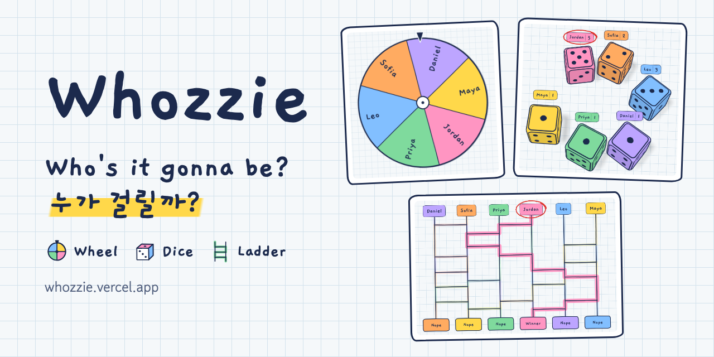
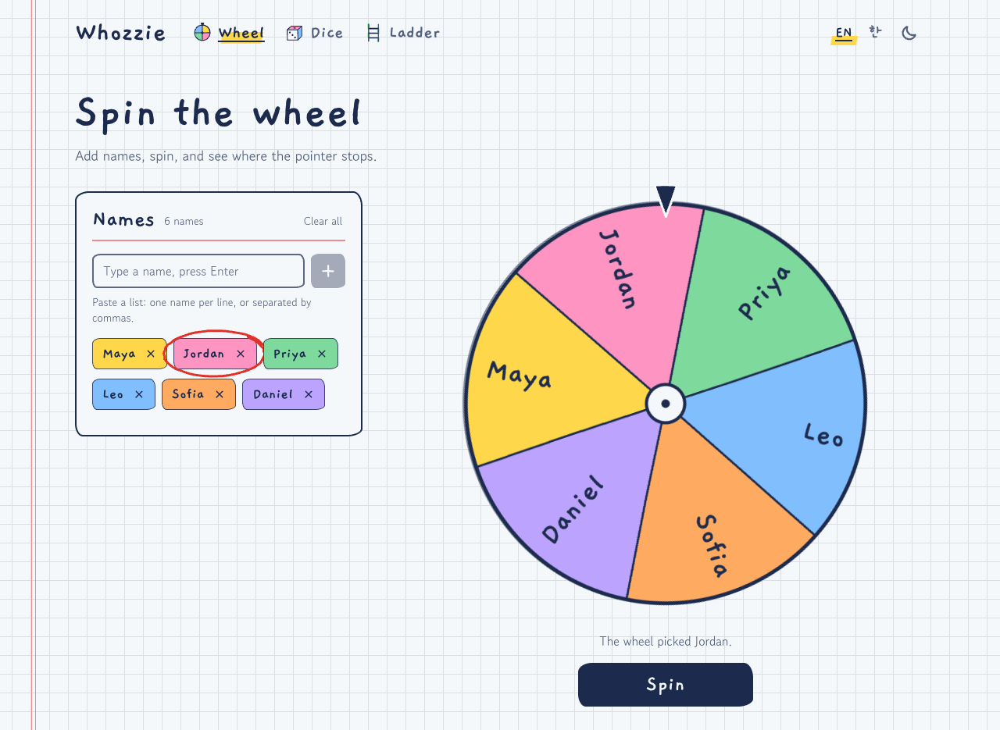
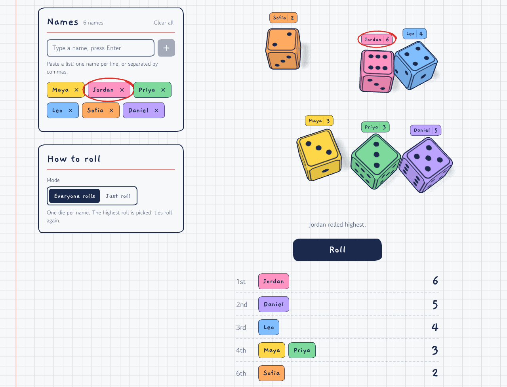
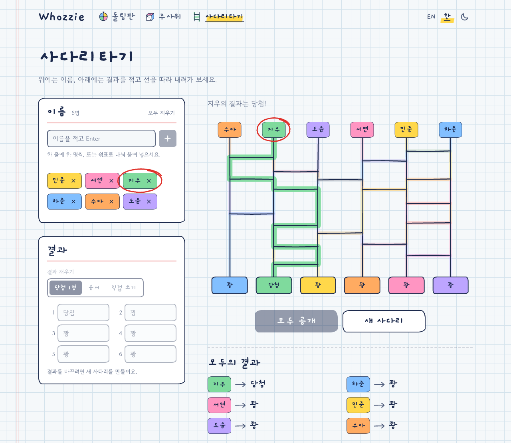
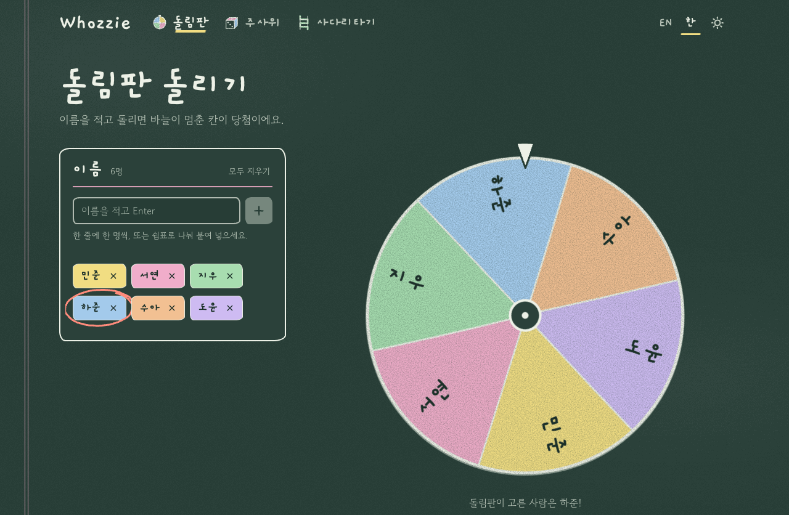
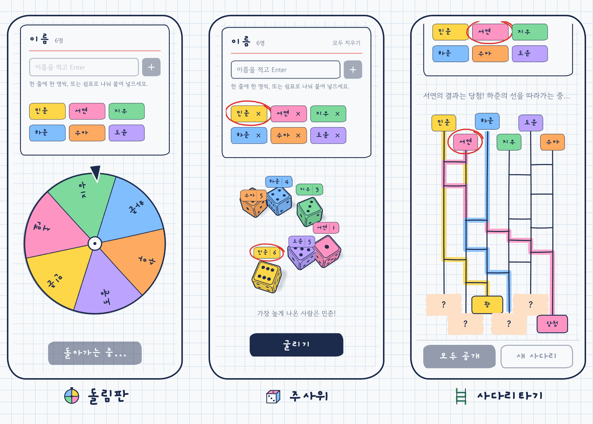

[English](README.md) | **한국어**



# Whozzie

이름을 한 번만 적어 두면 돌림판, 3D 주사위, 사다리타기로 누가 걸릴지 정할 수 있는 랜덤 뽑기 사이트예요.
가입 없이 무료로 [whozzie.vercel.app](https://whozzie.vercel.app/ko)에서 바로 써 볼 수 있어요.

[](https://github.com/zeikar/whozzie/actions/workflows/ci.yml)
[](LICENSE)
[](https://nextjs.org)

## 뽑는 방법 세 가지

### [돌림판](https://whozzie.vercel.app/ko/wheel)

이름마다 같은 크기의 칸이 생기고, 100명까지 넣을 수 있어요. 당첨자는 돌림판이 돌기 전에 이미 정해져 있고, 돌아가는
모습은 그 결과를 보여 주는 연출이에요. 바늘이 멈추는 자리도 칸 안에서 매번 달라요. 여러 명을 뽑으려면 결과 창에서
당첨자를 빼고 다시 돌리면 돼요.



### [주사위 굴리기](https://whozzie.vercel.app/ko/dice)

- **다 같이 굴리기** (이름 2~12개): 사람마다 자기 색 주사위를 하나씩 받고, 가장 높은 숫자가 나온 사람이 뽑혀요.
  1등이 여럿이면 그 사람들만 다시 굴려서 한 명이 남을 때까지 가려요. 전체 등수도 함께 나오고, 2등부터는 숫자가
  같으면 같은 등수를 받아요.
- **그냥 굴리기**: 이름 없이 주사위 1~6개를 굴려서 합계를 봐요. 보드게임 주사위를 잃어버렸을 때 쓰기 좋아요.

주사위는 Rapier 물리 엔진으로 움직이고 three.js로 그려요. 판 한쪽에서 던진 주사위가 벽이나 다른 주사위에 부딪히며
구르다가 멈추면, 윗면에 나온 숫자가 결과예요. 어딘가에 기대 비스듬히 멈춘 주사위는 살짝 튕겨서 눕혀 줘요. 고른
방식과 주사위 개수는 다음에 들어와도 그대로예요.



### [사다리타기](https://whozzie.vercel.app/ko/ladder)

위에는 이름(2~12명)을, 아래에는 결과를 적어요. 결과는 당첨 1명, 순서(1번, 2번, ...), 직접 쓰기(청소 당번이나 경품
같은 것) 중에서 고르면 돼요. 고른 결과는 섞어서 테이프로 가려 둬요. 이름을 누르면 그 사람의 선을 따라 내려가면서
가로줄을 만날 때마다 옆 선으로 건너가요. '모두 공개'를 누르면 남은 선을 차례로 따라가요. 적어 둔 결과는 저장되니까
매주 쓰는 당번표를 다시 칠 필요가 없어요.



## 특징

### 세 도구가 같이 쓰는 이름 목록

- 이름을 하나씩 적거나 명단을 통째로 붙여 넣으면 돼요. 명단은 한 줄에 한 명씩 쓰든 쉼표로 나누든 상관없고,
  스프레드시트에서 복사한 행도 그대로 받아요. 행 하나가 이름 하나가 되고, `1.` 같은 번호 칸은 빠져요.
- 이름은 100개까지, 이름 하나에 40자까지 넣을 수 있어요. 이미 있는 이름은 건너뛰고 어떤 이름이 겹쳤는지 알려 줘요.
- 목록은 브라우저의 `localStorage`에 저장되고, 다른 탭에서 고쳐도 바로 반영돼요. 이름은 서버로 보내지 않아요.
- 이름을 뺐더라도 몇 초 안에 '되돌리기'를 누르면 원래 자리로 돌아와요.
- 사람마다 색이 하나씩 정해져서, 그 사람의 이름표, 돌림판 칸, 주사위, 사다리 선이 모두 그 색으로 나와요.

### 공정한 뽑기

뽑기는 전부 `lib/random.ts`에서 `crypto.getRandomValues`(Web Crypto)로 하고, `Math.random`은 쓰지 않아요.
`randomInt`는 나머지 연산 때문에 편향(modulo bias)이 생기는 값이 나오면 버리고 다시 뽑아요. `shuffle`은 이
`randomInt`를 써서 Fisher-Yates 방식으로 섞어요.

- **돌림판**: 돌리기 전에 당첨자 번호를 균등하게 뽑아 두고, 돌림판은 그 칸에 맞춰 멈춰요.
- **주사위**: 주사위마다 출발 위치, 방향, 속도, 회전을 모두 암호학적 난수로 뽑고, 누가 어느 자리에서 출발할지도
  무작위로 정해요. 동작 줄이기(reduced motion)를 켰거나 WebGL이 안 되는 브라우저에서는 1~6 중 하나를 바로 균등하게
  뽑아요.
- **사다리타기**: 가로줄만으로는 공정하지 않아요. 가로줄이 적은 선은 거의 곧장 내려가서 바로 아래 결과에 닿기
  쉽거든요. 그래서 이름을 무작위 순서로 선 위에 세워서, 가로줄이 어떻게 놓이든 누구나 어느 결과에든 1/n 확률로
  걸리게 했어요. 아래쪽 결과도 섞어 두니까 가려진 칸만 보고는 뭐가 뭔지 알 수 없어요.
  `features/ladder/ladder.test.ts`에서 가로줄이 매번 똑같이 놓이는 사다리로도 확률이 1/n인지 확인해요.

화면 연출에만 쓰는 난수(손으로 그린 선의 흔들림, 처음 굴리기 전에 주사위가 보여 주는 면)는 시드를 고정한 PRNG로
만들어서 다시 그려도 똑같이 나와요. 뽑기에는 쓰지 않아요.

### 공책과 칠판

밝은 테마는 학교 공책 맨 뒷장이에요. 모눈종이 위에 볼펜과 형광펜으로 쓰고, 여백에는 빨간 줄이 그어져 있어요.
어두운 테마는 교실 칠판이라 그림에 분필 질감이 들어가요. 처음에는 시스템 설정을 따르고, 헤더의 스위치로 바꿀 수
있어요.

빨간 펜은 뽑힌 사람에게만 써요. 선생님이 채점하듯 그 이름에 동그라미를 쳐 주는데, 같은 이름이면 매번 같은 모양으로
그려져요. 제목, 이름, 버튼은 손글씨 폰트인 개구(Gaegu), 본문은 고운돋움(Gowun Dodum)이에요. 디자인 토큰은
`app/globals.css`에 있어요.



### 한국어와 영어

영어 페이지는 `/wheel`처럼 접두사가 없고, 한국어 페이지는 `/ko/wheel`처럼 `/ko` 아래에 있어요. 브라우저 언어가
한국어면 영어 페이지로 들어와도 `/ko` 페이지로 넘어가요. 같은 브라우저 세션에서 헤더의 언어 전환으로 영어를
골랐다면 영어 그대로 보여요. 문구와 검색용 메타데이터는 언어마다 따로 썼어요.

이름 입력에서는 한글을 특히 챙겼어요. 이름을 NFC로 정규화해서 한 기기에서 입력한 이름과 다른 기기에서 붙여 넣은
이름이 같으면 하나로 보고, 한글 조합 중에 Enter를 눌러도 반쯤 쓰다 만 이름이 들어가지 않아요.

### 휴대폰과 접근성

화면이 데스크톱보다 좁으면 한 단 레이아웃으로 바뀌고, 도구가 보이는 동안 메인 버튼('돌리기', '굴리기', '모두
공개')이 화면 아래에 붙어 있어요. 시스템에서 동작 줄이기를 켜 두면 모든 도구가 애니메이션 없이 바로 결과를 보여
주는데, 이때도 똑같이 공정해요. 스크린 리더가 결과를 읽어 주고, 결과 창은 HTML `<dialog>` 요소로 만들었어요.



## 기술 스택

- **Next.js 16** (App Router), **React 19**: 두 언어 페이지를 모두 미리 렌더링해요. 언어 라우팅은
  `proxy.ts`(Next 16부터 미들웨어 대신 쓰는 이름)에서 해요.
- **next-intl 4**: 라우팅과 문구를 맡고, 메시지는 `messages/en.json`을 기준으로 타입 검사해요.
- **Tailwind CSS v4**: 디자인 토큰은 CSS 변수로 두고, 라이트/다크 전환은 **next-themes**로 해요.
- **three.js**, **@react-three/fiber**, **@react-three/drei**, **@react-three/rapier**: 주사위에 써요. 주사위
  페이지에서만, 그것도 페이지가 뜬 다음에 불러와요.
- **Vitest**: 돌림판과 주사위 판의 기하 계산, 사다리 생성과 공정성, 주사위 승부와 멈춤 판정, 이름 목록, 난수 같은
  순수 로직을 테스트해요.
- **ESLint 9** (`eslint-config-next`)로 린트하고, 타입 검사는 **TypeScript 7**로 해요.
- 배포는 **Vercel**, 방문 통계는 Vercel Analytics예요.

## 시작하기

Node.js는 22(22.12 이상), 24, 26 이상 중 하나가 필요해요. Vitest 5가 지원하는 버전이에요(23, 25는 안 돼요). CI는
최신 LTS로 돌려요.

```bash
git clone https://github.com/zeikar/whozzie.git
cd whozzie
npm install
npm run dev        # http://localhost:3000 (한국어는 /ko)
npm test           # 단위 테스트 (Vitest)
npm run typecheck  # 라우트 타입 생성 + TypeScript 7
npm run lint
npm run build      # 프로덕션 빌드, 실행은 npm start
```

TypeScript는 두 버전을 같이 설치해요. `tsc`는 TypeScript 7(`@typescript/native`)이고, `typescript`는
typescript-eslint와 `next build`가 아직 쓰는 TS 6 API 패키지예요. ESLint는 `eslint-config-next`의 플러그인이
ESLint 10을 지원할 때까지 9로 둬요.

`main`에 푸시하거나 PR을 올리면 CI가 린트, 타입 검사, 테스트, 프로덕션 빌드를 돌려요.

`NEXT_PUBLIC_BASE_URL`로 canonical 링크, 사이트맵, Open Graph 태그에 쓰는 사이트 주소를 바꿀 수 있어요. 기본값이
`https://whozzie.vercel.app`이라서 포크해서 배포한다면 꼭 설정하세요.

## 프로젝트 구조

```
app/[locale]/             라우트: 홈, 도구별 페이지(뽑기 도구, 그 아래 <PickerNotes>), 404
app/global-not-found.tsx  어느 라우트에도 맞지 않는 주소의 404 (사이트 레이아웃 적용)
features/<picker>/        도구별 폴더: 컴포넌트, 순수 로직, 테스트
components/picker/        모든 도구가 같이 쓰는 것: PickerLayout, NamesCard, NameChip, StickyActions,
                          ResultDialog + Verdict + VerdictActions, PickerNotes (페이지 아래 서버 렌더링 안내글)
components/ui/            Button, Card, TextInput, SegmentedControl, RedPenCircle
components/site/          헤더, 내비게이션, 언어/테마 전환, 푸터, 분필 필터
components/icons.tsx      선 아이콘과 도구별 낙서 그림 (PICKER_DOODLES)
lib/                      site.ts (PICKER_IDS, 사이트 주소), names.ts (공유 이름 목록), random.ts (암호학적 난수),
                          markers.ts (사람별 색), sketch.ts (손그림 경로), metadata.ts, 훅: use-persisted-state
                          (설정 기억), use-reduced-motion, use-theme-colors (WebGL용 팔레트)
i18n/                     next-intl 라우팅: 영어는 접두사 없이, 한국어는 /ko
messages/{en,ko}.json     문구. 도구마다 네임스페이스 하나
proxy.ts                  언어 라우팅 (Next 16의 미들웨어)
```

## 뽑기 도구 추가하기

1. `lib/site.ts`의 `PICKER_IDS`에 id를 추가하세요. 내비게이션, 홈, 사이트맵에는 자동으로 들어가요.
   `components/icons.tsx`의 `PICKER_DOODLES`에는 낙서 그림을 넣어 주세요.
2. `messages/en.json`과 `messages/ko.json` 양쪽에 `wheel`과 같은 구조로 네임스페이스를 만드세요. `name`,
   `summary`, `meta`(`title`, `description`, `keywords`), `heading`, `lede`, 그리고 도구 아래 안내글인
   `about`(`how.title`과 `how.step1`~`step3`, `fair.title`과 `fair.body`, `uses.title`과 `uses.body`)이 들어가요.
   `about`은 서버에서만 렌더링되고 브라우저로 보내는 메시지에서는 빠져요. `uses.body`에서는
   `<wheel>돌림판</wheel>`처럼 id를 태그로 써서 다른 도구로 가는 링크를 걸 수 있어요.
3. `features/<id>/`에 `PickerLayout`, `NamesCard`, `StickyActions`(메인 버튼), `ResultDialog` + `VerdictActions`를
   바탕으로 도구를 만들고, 로직은 일반 모듈로 빼서 옆에 테스트를 두세요. 뽑기는 `lib/random.ts`로 하고, 설정은
   `usePersistedState`로 기억하고(키는 `whozzie:<id>:<setting>` 형식), `useReducedMotion()`이 true면 바로
   결과로 넘어가게 하세요.
4. `app/[locale]/wheel/page.tsx`를 복사해서 `app/[locale]/<id>/page.tsx`를 만드세요. 페이지에는 뽑기 도구를
   넣고, 그 아래에 `<PickerNotes>`를 두세요.

## 라이선스

[MIT](LICENSE)
