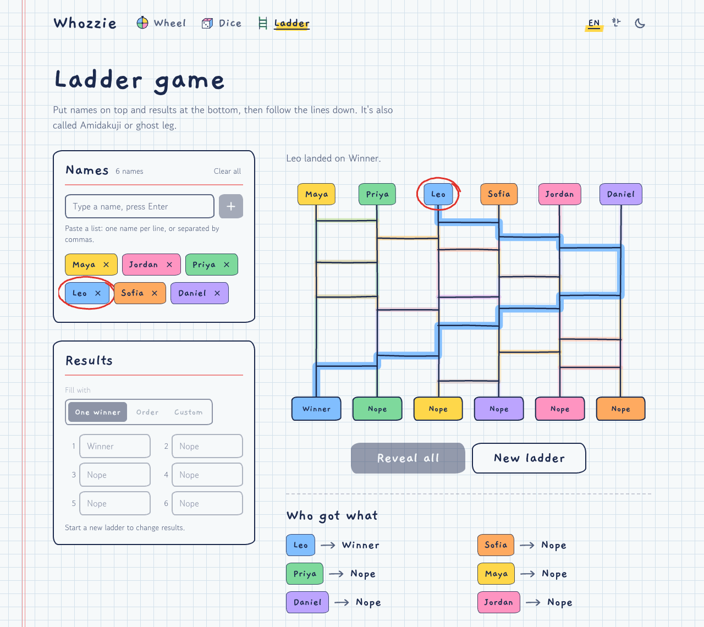

**English** | [한국어](README.ko.md)


# Whozzie

A random name picker for groups: write the names once, then spin a wheel, roll 3D dice, or play the ladder game.
Free, no sign-up, in English and Korean at **[whozzie.vercel.app](https://whozzie.vercel.app)**.

[](https://github.com/zeikar/whozzie/actions/workflows/ci.yml)
[](LICENSE)
[](https://nextjs.org)

## Three ways to pick

### [Wheel](https://whozzie.vercel.app/wheel)

Every name gets an equal slice, up to 100 names. The winner is drawn before the wheel moves, and the spin just plays out
the result, stopping somewhere inside the winner's slice rather than dead center. To pick several people, remove each
winner from the result slip and spin again.


### [Dice](https://whozzie.vercel.app/dice)

- **Everyone rolls** (2 to 12 names): each person gets a die in their color, and the highest roll is picked. If the top
  roll is tied, only the tied players roll again, until one is left. Everyone gets a place in the standings, and people
  tied further down share theirs.
- **Just roll**: 1 to 6 plain dice with no names, and the total. Handy when a board game's dice have gone missing.

The dice are rigid bodies in a Rapier physics world drawn with three.js. They're thrown in from one side of the table,
bounce off the walls and each other, and the face on top when they settle is the roll. A die left leaning on a wall or
another die gets a nudge to knock it flat. The mode and number of dice are remembered for your next visit.


### [Ladder game](https://whozzie.vercel.app/ladder) (Amidakuji)

Names go on top, 2 to 12 of them, and results along the bottom: one winner, an order (1st, 2nd, ...), or your own text,
such as chores or prizes. The results are shuffled and taped over. Pick a name to trace its line down, crossing every
rung it meets, or press Reveal all to trace the rest one after another. The results you set are remembered, so you don't
retype a weekly chore list.



## Details

### One list of names

- Type names one at a time, or paste a list: one per line, separated by commas, or rows copied from a spreadsheet (each
  row becomes one name, and a numbering column like `1.` is dropped).
- Up to 100 names of up to 40 characters each. Duplicates are skipped, with a note saying which.
- The list lives in your browser's `localStorage`, shared by all three tools and kept in sync across open tabs. Names
  are never sent anywhere.
- A removed name can be put back with Undo for a few seconds, in its old place.
- Each person keeps one marker color everywhere: their name chip, wheel slice, die and ladder line.

### Fair picks

Picks come from `crypto.getRandomValues` (Web Crypto) through `lib/random.ts`, never from `Math.random`. `randomInt`
redraws values that would cause modulo bias, and `shuffle` is a Fisher-Yates shuffle on top of it.

- **Wheel:** the winner's index is drawn uniformly before the spin, and the animation is aimed at that slice.
- **Dice:** each die's starting position, orientation, velocity and spin are drawn from crypto randomness, and who gets
  which starting spot is shuffled. With reduced motion, or in a browser without WebGL, each face is drawn directly as a
  uniform 1 to 6.
- **Ladder:** the rungs alone wouldn't be fair, since a line with few rungs mostly runs straight down to the result
  below it. Players are seated on the lines in a uniformly shuffled order, so each player lands on each result with
  probability 1/n however the rungs fall, and the results are shuffled along the bottom so the covered slots give
  nothing away. `features/ladder/ladder.test.ts` checks this, including with a ladder whose rungs always fall the same
  way.

Randomness that's only for looks (the wobble of hand-drawn lines, the faces dice show before the first roll) comes from a
seeded PRNG, so it's the same on every render. It's never used for a pick.

### Notebook and chalkboard

The light theme is the back page of a school notebook: graph paper, ballpoint-blue ink, highlighter colors and a red
margin rule. The dark theme is a classroom chalkboard, with chalk grain on the drawings. It follows your system setting
until you flip the switch in the header.

The red pen is kept for the verdict: it circles whoever gets picked, with a hand-drawn loop that's the same every time
for the same name. Headings, names and buttons are in the Gaegu handwriting font, and reading text is in Gowun Dodum.
The design tokens live in `app/globals.css`.


### English and Korean

English is at the bare URLs and Korean under `/ko`. A browser set to Korean that opens an English page is sent to its
`/ko` version, unless English was picked with the language switch in that browser session. Each language has its own
copy and search metadata. Name input is built for Hangul too: names are normalized to NFC, so a name typed on one
device and pasted from another counts once, and the Enter that finishes composing a syllable doesn't add half a name.

### Phones and accessibility

Below desktop width the page is one column, and the main buttons (Spin, Roll, Reveal all) stick to the bottom of the
screen while the tool is in view. If your system asks for reduced motion, every tool skips straight to the result, which
is just as fair. Results are announced to screen readers, and the result slip is a native `<dialog>`.


## Tech stack

- **Next.js 16** (App Router) and **React 19**. Pages are prerendered for both languages, and `proxy.ts` (Next 16's name
  for middleware) runs next-intl's locale routing.
- **next-intl 4** for routing and copy. Messages are type-checked against `messages/en.json`.
- **Tailwind CSS v4**, with the design tokens as CSS variables, and **next-themes** for the light/dark switch.
- **three.js**, **@react-three/fiber**, **@react-three/drei** and **@react-three/rapier** for the dice. They load only on
  the dice page, after the page is up.
- **Vitest** for the pure logic: wheel and table geometry, ladder generation and fairness, the dice contest and
  settling, the names list, randomness.
- **ESLint 9** with `eslint-config-next`, and **TypeScript 7** for type checking.
- Hosted on **Vercel**, with Vercel Analytics.

## Getting started

You need Node.js 22 (22.12 or later), 24, or 26 and up, the versions Vitest 5 supports (23 and 25 aren't). CI uses the
current LTS.

```bash
git clone https://github.com/zeikar/whozzie.git
cd whozzie
npm install
npm run dev        # http://localhost:3000 (Korean at /ko)
npm test           # unit tests (Vitest)
npm run typecheck  # route types + TypeScript 7
npm run lint
npm run build      # then npm start to serve it
```

TypeScript is installed side by side: `tsc` is TypeScript 7 (`@typescript/native`), while `typescript` is the TS 6 API
package that typescript-eslint and `next build` still need. ESLint stays on 9 until `eslint-config-next`'s plugins
support 10.

CI runs lint, typecheck, tests and the production build on every push to `main` and on pull requests.

`NEXT_PUBLIC_BASE_URL` sets the site URL used for canonical links, the sitemap and Open Graph tags. It defaults to
`https://whozzie.vercel.app`, so set it when you deploy a fork.

## Project structure

```
app/[locale]/             routes: home, one page per picker (the picker, then <PickerNotes>), the 404
app/global-not-found.tsx  the 404 for URLs that match no route, inside the site's layout
features/<picker>/        one folder per picker: components, pure logic, tests
components/picker/        what every picker shares: PickerLayout, NamesCard, NameChip, StickyActions,
                          ResultDialog + Verdict + VerdictActions, PickerNotes (server-rendered notes under the page)
components/ui/            Button, Card, TextInput, SegmentedControl, RedPenCircle
components/site/          header, nav, language + theme switches, footer, the chalk filter
components/icons.tsx      stroke icons, and each picker's doodle (PICKER_DOODLES)
lib/                      site.ts (PICKER_IDS, site URL), names.ts (the shared list), random.ts (crypto picks),
                          markers.ts (colors), sketch.ts (hand-drawn paths), metadata.ts, and hooks:
                          use-persisted-state (remembered settings), use-reduced-motion, use-theme-colors (the
                          palette for WebGL)
i18n/                     next-intl routing: English unprefixed, Korean under /ko
messages/{en,ko}.json     copy; one namespace per picker
proxy.ts                  locale routing (Next 16's middleware)
```

## Adding a picker

1. Add its id to `PICKER_IDS` in `lib/site.ts` (nav, home page and sitemap pick it up) and a doodle to
   `PICKER_DOODLES` in `components/icons.tsx`.
2. Add a namespace shaped like `wheel` to both `messages/en.json` and `messages/ko.json`: `name`, `summary`, `meta`
   (`title`, `description`, `keywords`), `heading`, `lede`, and `about` for the notes under the picker (`how.title`
   and `how.step1` to `step3`, `fair.title` and `fair.body`, `uses.title` and `uses.body`). `about` is rendered on the
   server only and kept out of the messages sent to the browser. `uses.body` can link another picker by id, like
   `<wheel>spin the wheel</wheel>`.
3. Build it in `features/<id>/` on top of `PickerLayout`, `NamesCard`, `StickyActions` (its main buttons) and
   `ResultDialog` + `VerdictActions`, with its logic in plain modules and tests beside them. Draw the pick with
   `lib/random.ts`, remember settings with `usePersistedState` (keys like `whozzie:<id>:<setting>`), and skip to the
   result when `useReducedMotion()` is true.
4. Add `app/[locale]/<id>/page.tsx`, copying `app/[locale]/wheel/page.tsx`: the picker, then `<PickerNotes>`.

## License

[MIT](LICENSE)
